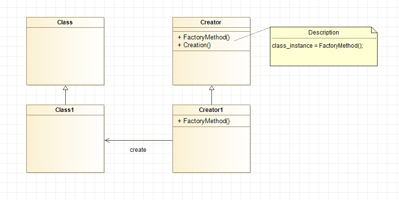
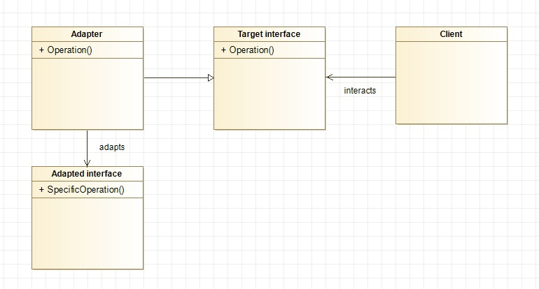
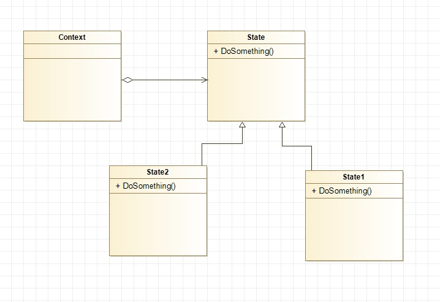
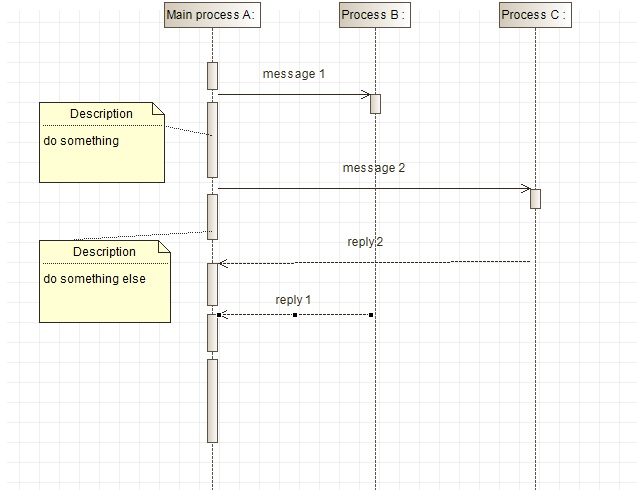
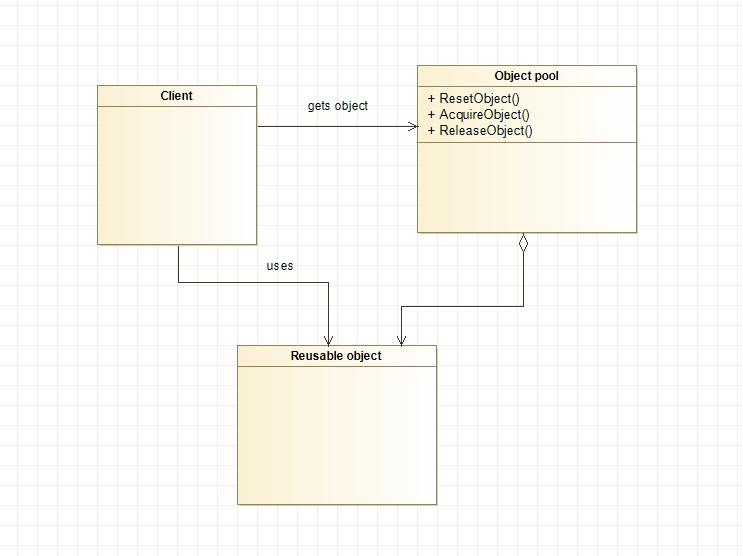

1. *Creational pattern: factory method*
Factory method is used to create an object without explicitly specifying its subclass. E.g. if there are two subclasses B and C of a class A, we can create two classes with factory methods that create and return instances of D and C correspondingly. That would allow to just create an instance of A and call for it a factory method of either B or C. If needed, it can be changed later without changing the class.

2. *Structural pattern: adapter*
Adapter converts an interface of a class into another interface that the client works with (in case otherwise they are not compatible).

3. *Behavioral pattern: state*
A state pattern allows an object to behave depending of its state. States are implemented as derived classes.

4. *Concurrency pattern: event-based asynchronous*
Event-based asynchronous pattern allows to perform several tasks simultaneously, without waiting until one of them is completed.

5. *Diverse pattern: object pool*
An object pool stores a set of initialized objects (that might be expensive to create) and provides them to the application, when needed. After the usage, an object is returned to the pool. 

