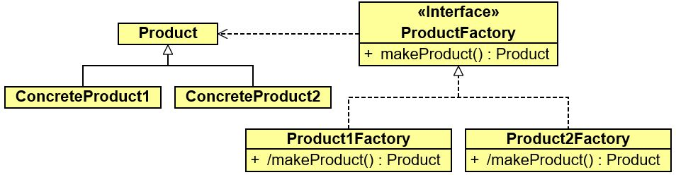
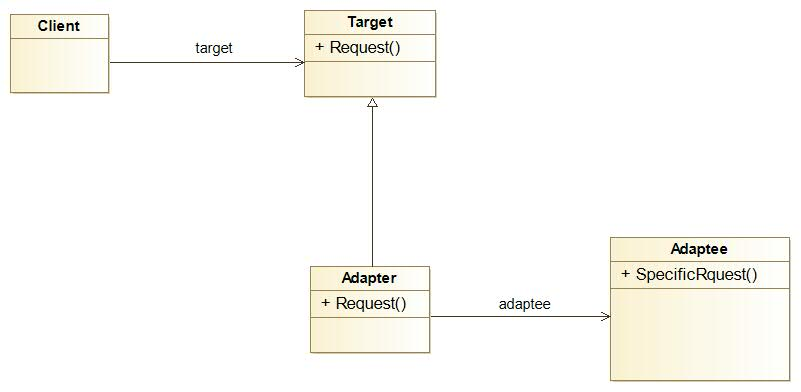
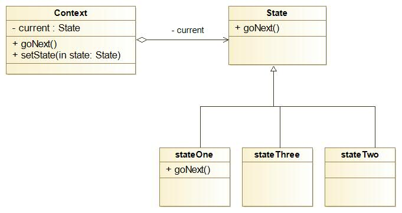
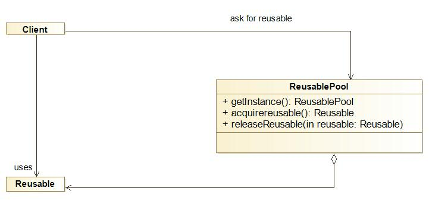
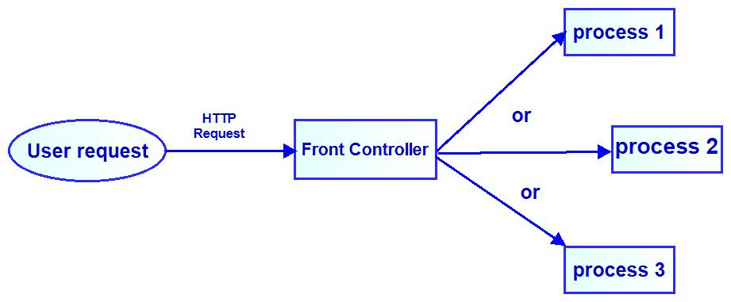

1. *Creational Patterns: factory method*
Factory method is used when we have an object with two or more subclasses and we need to call an instance of the subclass without knowing which subclass should use before the run time eg. if we have a main class A and there are two subclasses B & C of it and we don't know which subclasses should be called during runtime (B,C) so we made a factory method in the main class A to choose from B or C

2. *Structural patterns: adapter method*
Convert the interface of a class into another interface clients can deal with. Adapter lets classes with incompatible interfaces work together.

3. *Behavioral patterns: state*
Allow an object to change its behavior when its internal state changes. The object will appear to change its class.

4. *Concurrency patterns: event-based asynchronous*
sallows the software to perform more than one task in the same time, ie no need to wait until the end of a task to start another one. 

5. *Diverse: object pool*
Object pool uses a set of initialized objects kept ready to use because the cost of initializing the class instance is high, so the object pool let client 'checkout' objects from it and when this objects no longer needed so they will be returned to the pool in order to be used later

6. *Architectural patterns:front controller*
provide a centralited request handler so all the request will be handeled by one handler (commonly used in web application)
