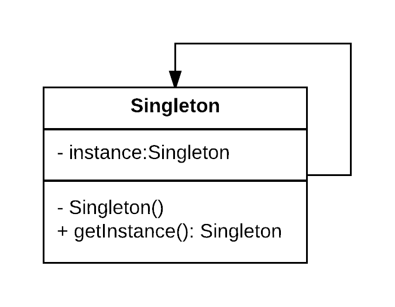
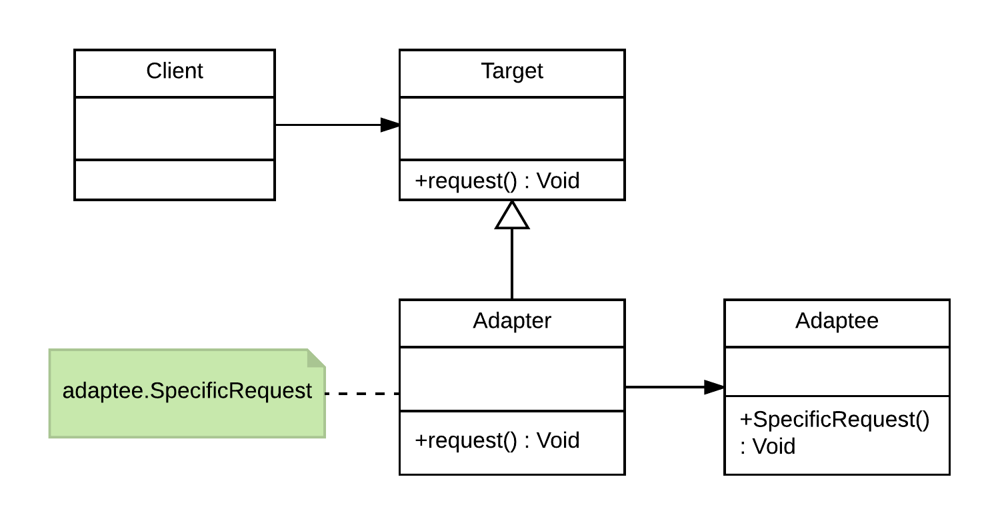
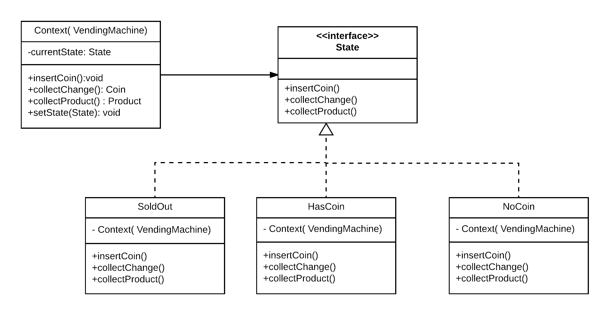
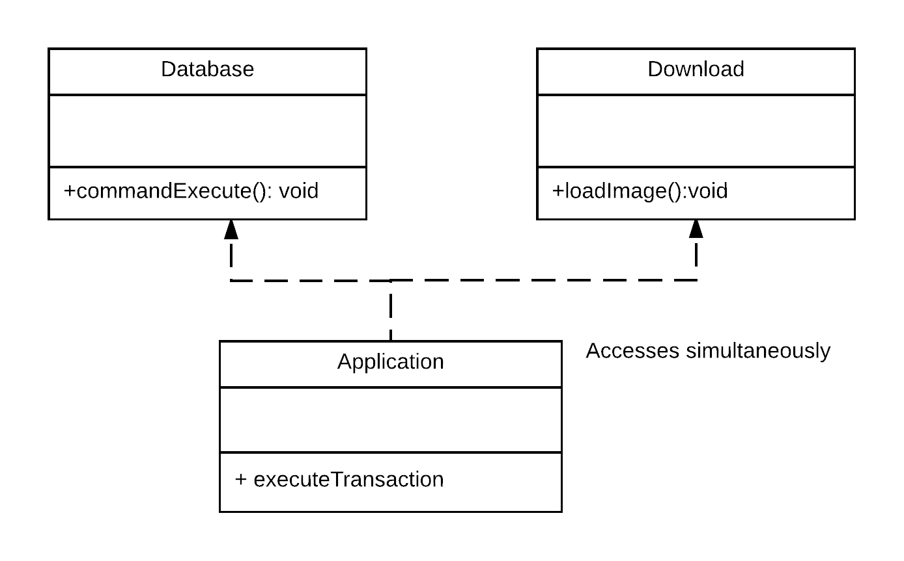
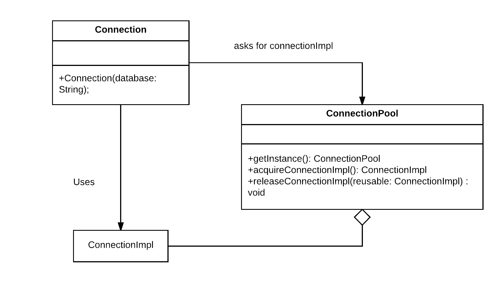

# Task 2

### Creational Pattern: 
*Singleton*

The singleton pattern is one of the simplest design patterns, it involves only one class which is responsible to instantiate itself.
This pattern is used when there is a need for only one instance across the application (i.e, centralized management of internal
or external resources) providing global point of access to the created instance.
In this case the same instance can be used from everywhere, being impossible to invoke directly the constructor each time.
 Example : Connection to redis database should be done once and same instance has to be accessed throughout the application.
 
 
 

### Structural Pattern:
*Adapter*

The adapter pattern is adapting between classes and objects. It is used to be an interface, a bridge between two objects.
It allows incompatible classes to work together by converting the interface of one class into an interface expected by the other class.

### Behavioral Pattern:
*State*

The State pattern allows an object to change its behavior when its internal state changes.
For instance, this pattern can be observed in a vending machine. When currency is deposited and a selection is made, a vending machine will either deliver a product and no change, deliver a product and change, deliver no product due to insufficient currency on deposit, or deliver no product due to no inventory.

### Concurrency Pattern
*Event-Based Asynchronous*

The Event-based Asynchronous Pattern makes available the advantages of multithreaded applications. Applications that perform many tasks simultaneously, yet remain responsive to user interaction, often require a design that uses multiple threads. 
For instance, Performs time-consuming tasks, such as downloads and database operations, "in the background," without interrupting your application.

### Diverse Pattern
*Object Pool*

The object pool pattern is a design pattern that uses a set of initialized objects kept ready to use in a "pool" instead of allocating and destroying them on demand. A client of the pool will request an object from the pool and perform operations on the returned object. When the client has finished, it returns the object to the pool rather than destroying it, this can be done manually or automatically.

