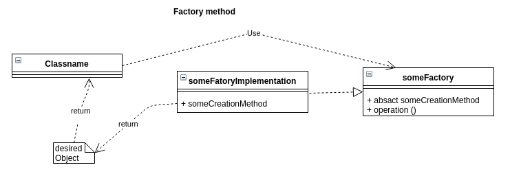
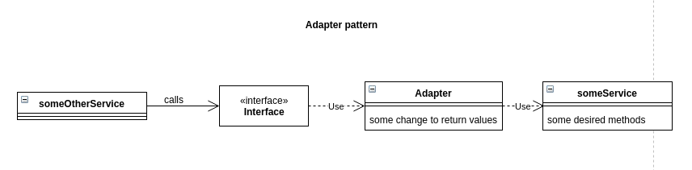
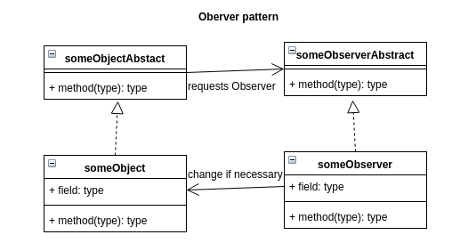
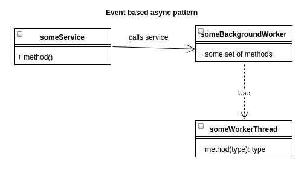
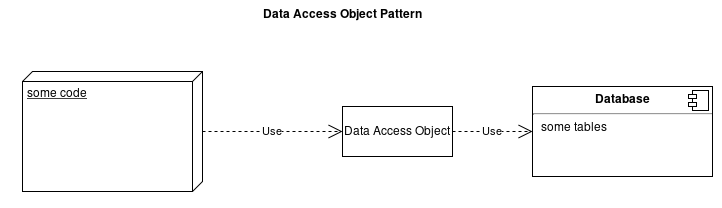

## Pattern with UML Diagram

### Creational pattern: Factory Method
A Factory Method is used to create a desired object without calling the regarding real constructor.
A factory is used to create an instance of an object with preset data, e.g. uniqueId, etc.

### Structural pattern: Adapter
A adapter is a class, which wraps around an object to include it in the current codebase. It transforms data objects from code-based form to adapter-needed form.

### Behavioural pattern: Observer
You can attach an observer to an existing object. If the object gets into a new state, the observer is called. This is mostly used in event-based systems.

### Concurrency pattern: event-based async
This describes a service, which can get tasks, which can be transferred to worker threads asynchronusly.

### Architectual pattern: data access object
Describes an adapter between DBMS and program, which is used to decouple the program from the DBMS. The DBMS can be changed later easily.
