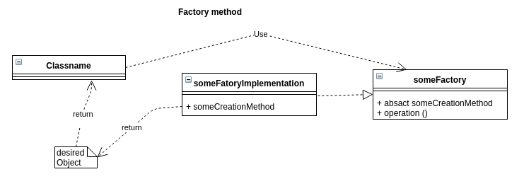
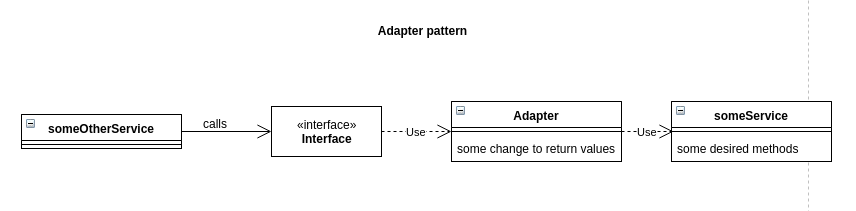
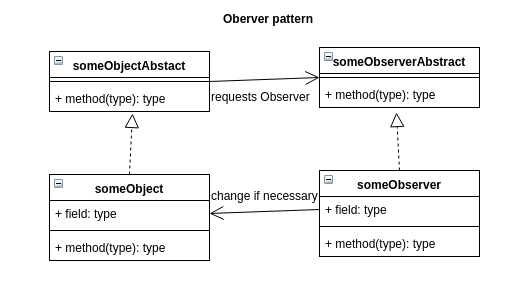
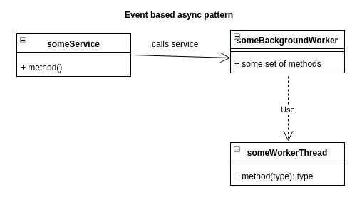
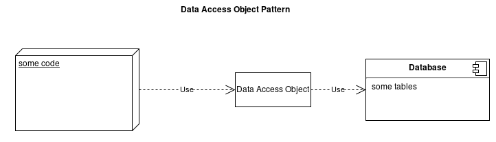

## Pattern with UML Diagram

### Creational pattern: Factory Method
A Factory Method is used to create a desired object without calling the regarding real constructor.

### Structural pattern: Adapter
An adapter pattern is used to enable the usage of a seperate system native not compatible with the current code

### Behavioural pattern: Observer
An observer pattern is used to control individual instances of one main class to shared variables which are not linked per reference for example

### Concurrency pattern: event-based async
Describes a service which can always receives tasks and send them further to subworkers to enable a realtime task solving ability

### Architectual pattern: data access object
Describes the middleman between a program and a database allowing the program to work unrelated to the current DBMS 
