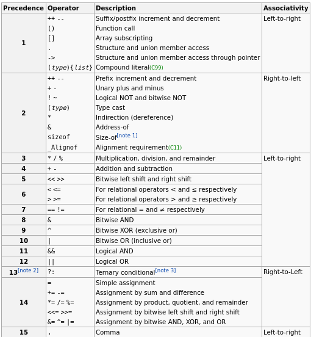

### Bracing in correspondence to operator precedence

(z & (((x ++) - ((char) ! (- (z --)))) - ((x + 5) >> y)))

- Interesting parts:
	+ ! (- (z --))
	+ I thought that since the suffix decrement has the highest priority this has to be, of course, the first enclosing, after that the minus flips the first bit of the previously already enclosed experession, and lastly the ! which flips all bits in the following experession.
	+ z &
	+ this is probably a bitwise and not the address-of operator

Source: http://en.cppreference.com/w/c/language/operator_precedence